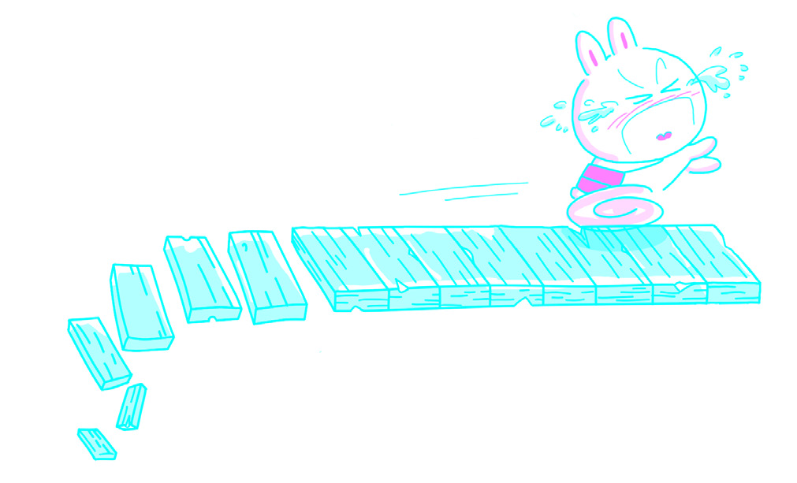

# 1. 问题

或许因为考试临近，或许因为工作需要，你现在必须把一本书读完。这本书的内容不是轻松的文字，所以不能一目十行——它需要你认真阅读并理解，甚至可能要求你根据它所陈述的原理或者规则进一步创造一些什么，才算真正“有所收获”。

经过一番挣扎，你终于决定“正式开始”！你坐到喜欢的沙发上，打开常听的音乐，翻开书的某一页开始看。

过了一会儿，你突然觉得自己非常渴，想要找水喝。你打开冰箱顺手拿出一瓶饮料，倒进杯子。刚喝了一口，你一下子想起来：不对，不应该喝这种含糖的饮料！真是的，无论说多少次，妈妈都不会记得把含糖的饮料和不含糖的饮料分开放！于是，你跑到妈妈的卧室，与她“理论”了一番，最终发现于事无补，只好一个人悻悻地回来整理冰箱。

你重新回到沙发上，接着看你的书。看了一会儿，你换了个姿势。不巧压到了电视遥控器，电视一下子亮了。这位节目主持人恰好是你最喜欢的。哇，今天她这身打扮真漂亮！不过今天的话题怎么这么无聊？！你还是不由自主地看了一会儿，又顺手用遥控器翻了翻其他频道……幸亏这时一连几个频道都没有好节目，你才停下来，有点失望地想：现在的节目真的很无聊，还不如看书呢！

嗯？怎么这么渴？你这才想起来，整理冰箱前，你把那杯含糖的饮料放在了妈妈的桌子上，却忘了重新给自己倒一杯不含糖的饮料，就直接回到了沙发上。于是你再次起身去弄喝的。喝了两口，你突然想起来你现在正喝的饮料是你最喜欢的——第一次约会的时候，你喝的就是这种饮料……

手机响了，是一条短信。一个朋友问：“你在干嘛？”你没好意思说你在学习，只是含混地说，你病了，在家休息，不想出去……结果朋友竟然打电话过来慰问，你只好支支吾吾地应付了一阵子。

挂了电话，你又回到沙发上。想了想，还是换一下背景音乐吧，现在这首听上去太伤感。于是你扭身摆弄了一会儿音乐播放器，然后重新坐好开始看书。

过了好一阵子，你突然意识到自己刚刚在发呆。打了个寒颤，你下意识地看了一下表—天哪！已经过去两个小时了，可是你连一页书都没看完！

以上的描述，说的肯定不是你，但那场景你一定很熟悉。

终于，在某一刻，你失声惊呼：“没时间了！”

这尴尬，无论是谁，要么已然经历，要么将会经历，没有例外。这尴尬一旦出现，必然压力无比巨大，而且来自四面八方。这种巨大的压力所造成的恐慌，往往可以使当事人做出荒诞不经、让其他人匪夷所思的决定：自相矛盾、自我欺骗、孤注一掷、痴心妄想……诸如此类，不一而足。

完成任何任务都需要一定的时间。同时，任何任务都最好或必须在某个特定的时间点之前完成，即，任务都有一个最后期限。而且，只要是必须完成的任务，不管是否已经开始执行，最后期限[^“最后期限”在英文中 对应的是“deadline”， 一个特别生动形象的 词：届时未完成者死！]就在不断迫近，因为时间永不停歇。

问题好像很简单，看起来无非有以下几种情况。

▷ 没有按时开始执行任务。
▷ 错误估算完成任务所需时间。
▷ 在任务的执行过程中出现了差错。

果真如此的话，那么解决方案好像也很简单。

▷ 按时开始执行任务。
▷ 正确估算完成任务所需时间。
▷ 在执行任务的过程中不要出差错。

可事实上问题并非如此简单，否则也不会让那么多人一 生都束手无策。

